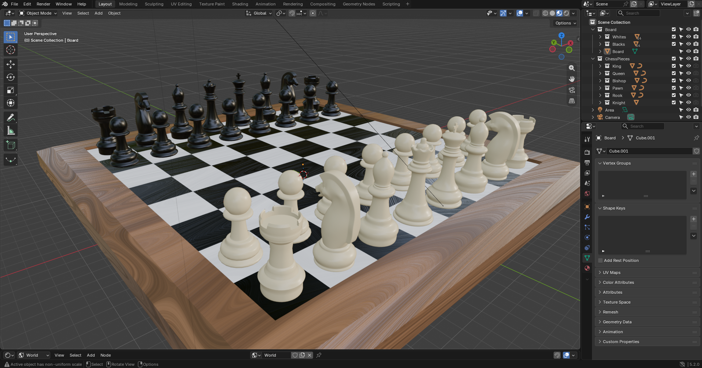
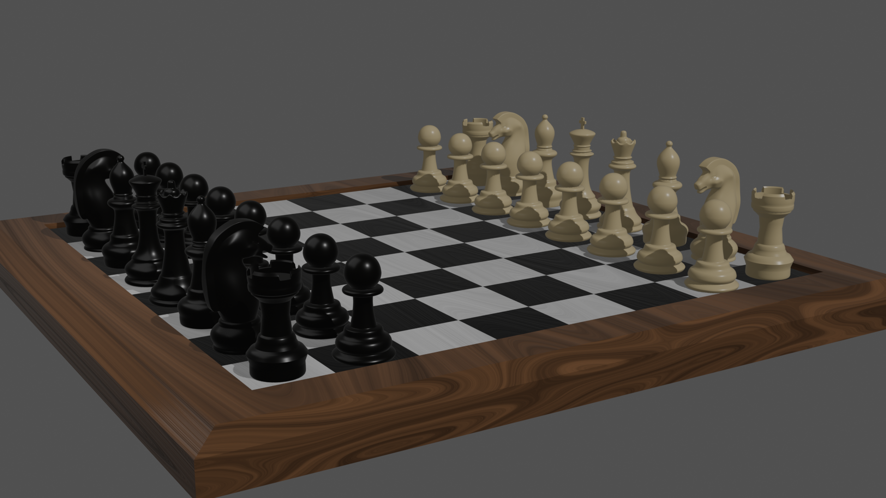

# Chessboard – Blender

3D model šachovnice a šachových figurek vytvořený v Blenderu v rámci kurzu 3D modelování.

Projekt zahrnuje modelování šachovnice a jednotlivých figurek, tvorbu materiálů, sestavení scény, osvětlení a výsledný render.

## Náhled

## Projekt

Zdrojový `.blend` soubor je dostupný v tomto repozitáři.
